# Sketch Measure React

A sketch plugin to export your designs as react applications. Quickly share design specs, css, and assets.

## Getting Started

Select an artboard in your sketch file.

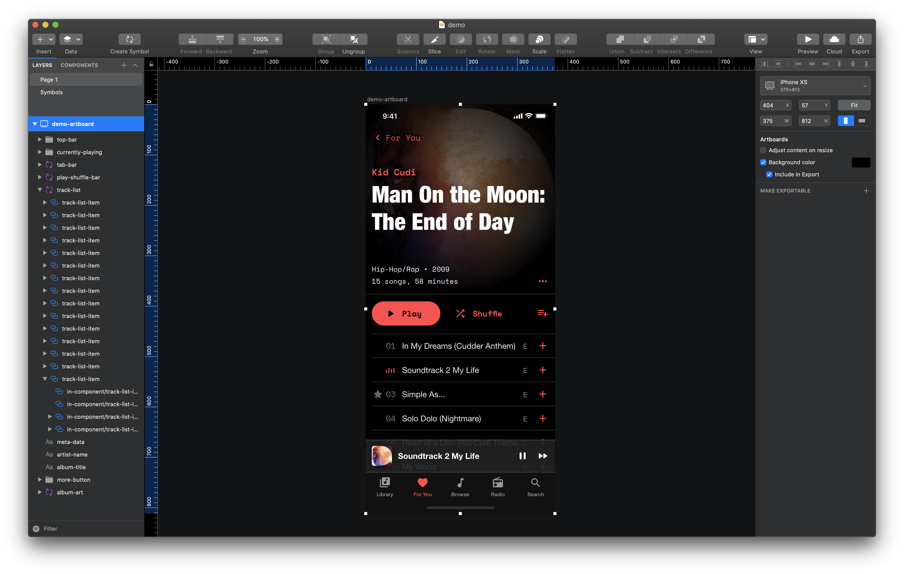

Run plugin to compose export.

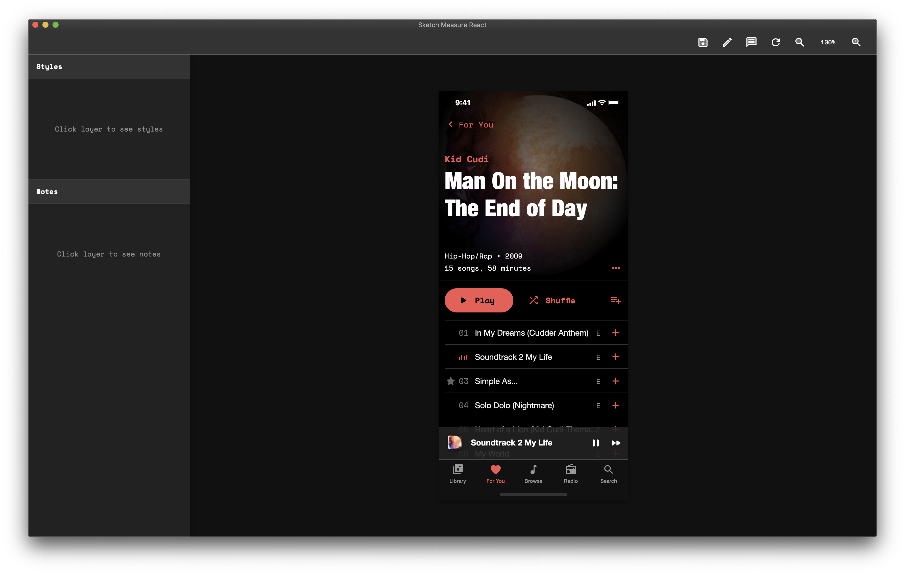

Hover over layers to see dimensions.

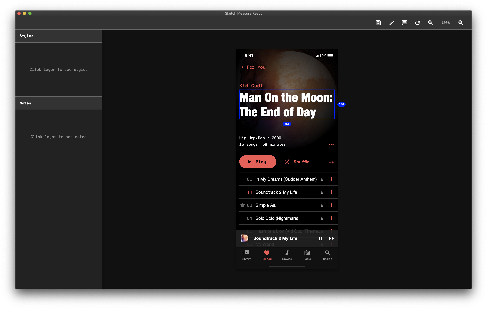

Select layers to see styles and assets. While selected, you can hover over other layers to see relative spacing.

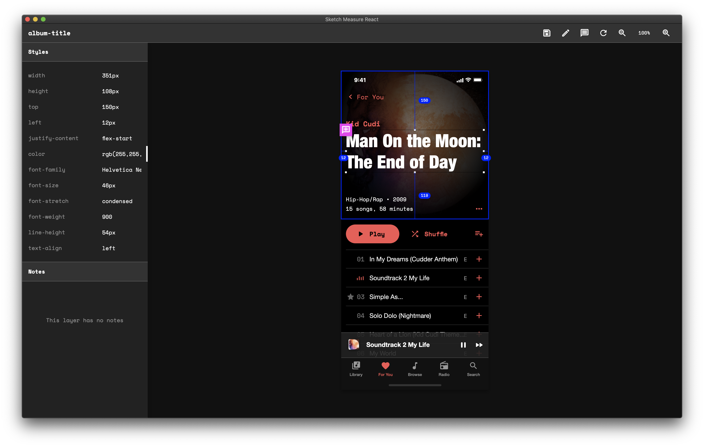

Images are base64 strings.

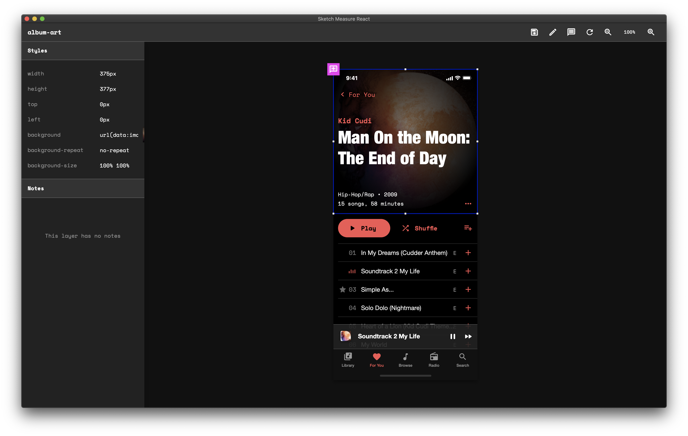

Add layer notes.

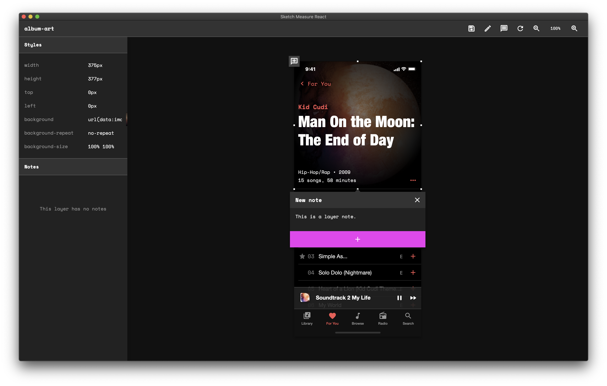

Shapes and ShapePaths that aren't ovals or rectangles are converted to svgs.

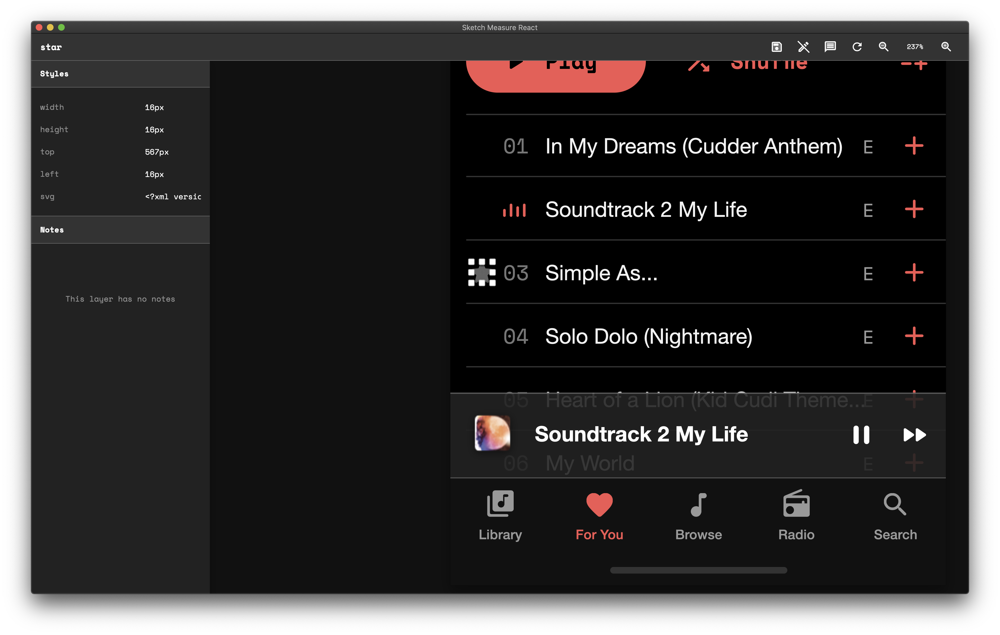

Quickly copy styles, images, and svgs to clipboard.

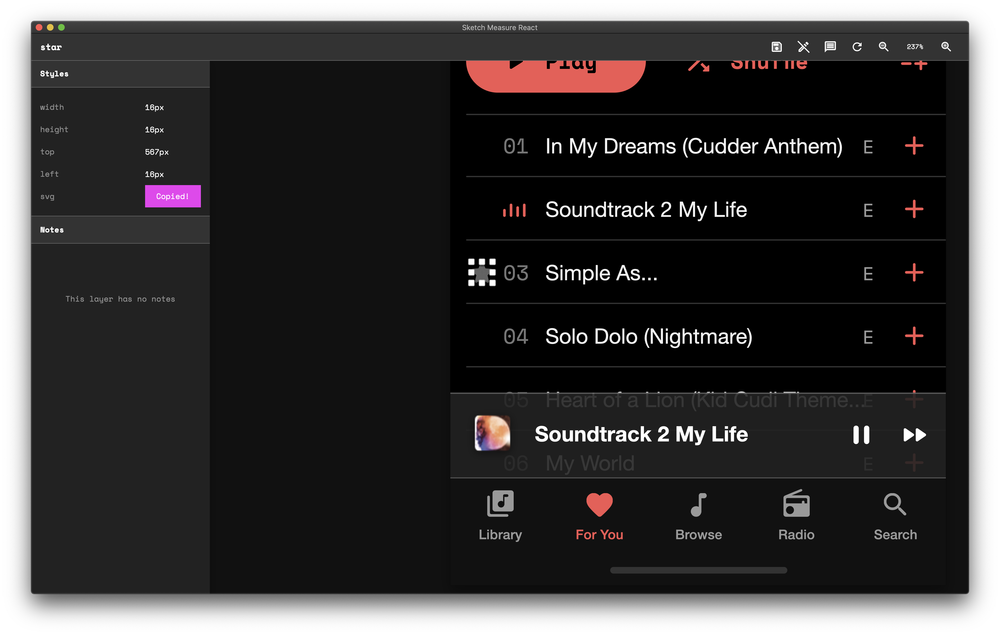

Export spec

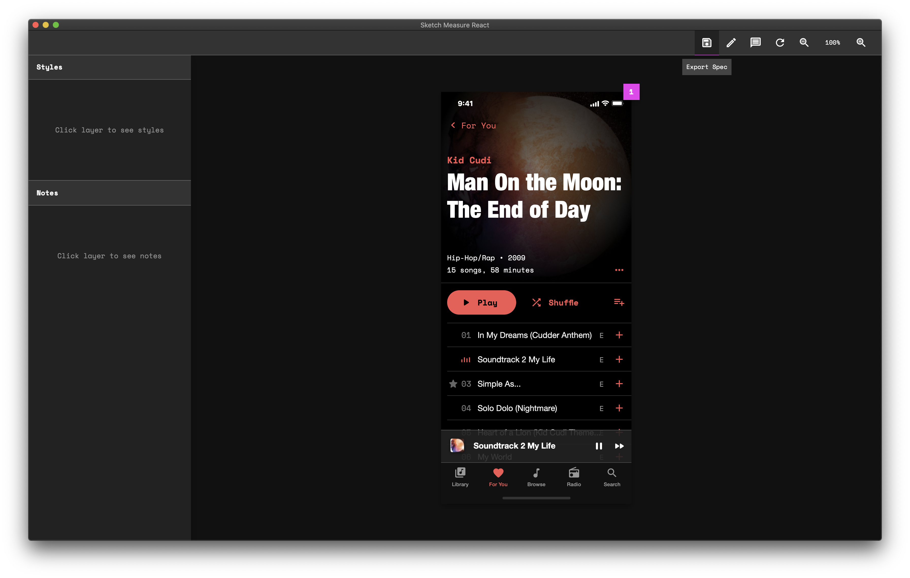

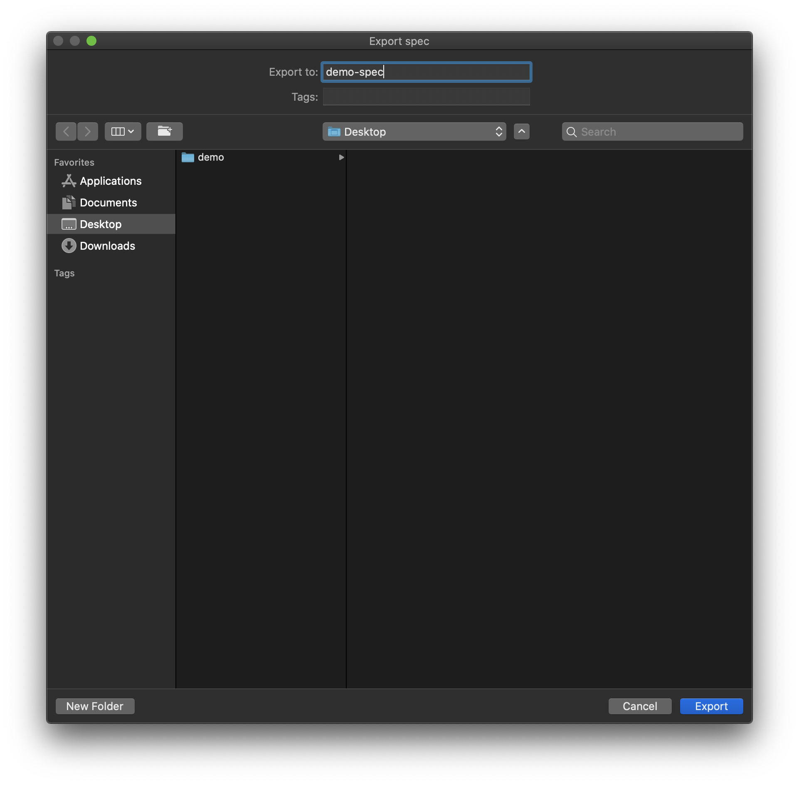

Export folder structure. Open spec.html in your preferred browser to view spec.

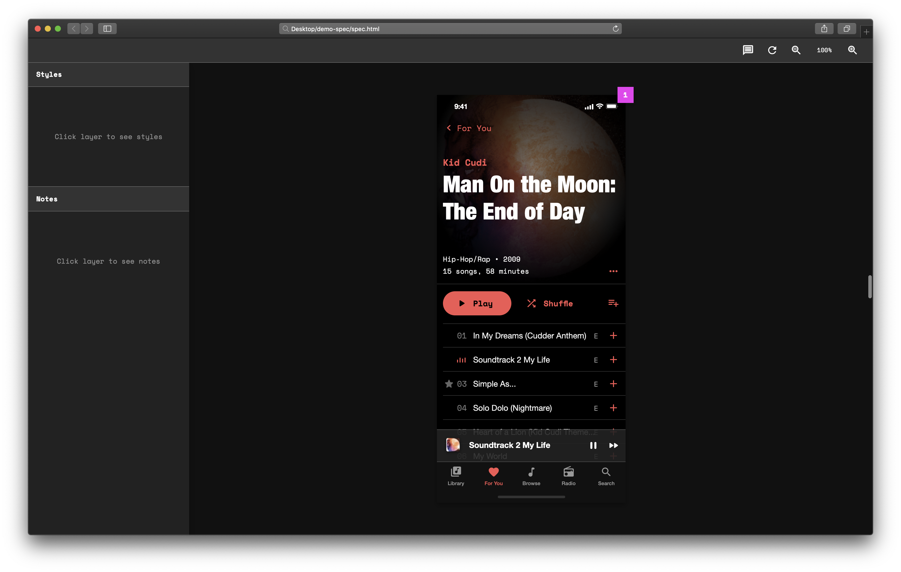

Toggle note indicators with show/hide notes.

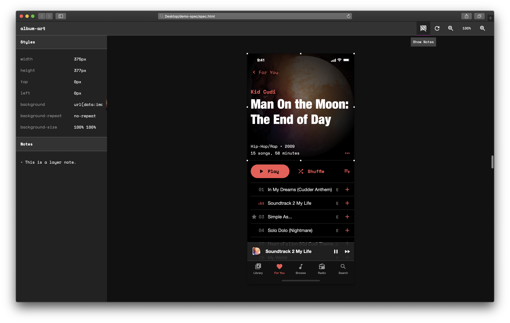

### Spec Export Details

- Max canvas size: `20,000px` by `20,000px`
- All symbols are detached.(does not affect original symbols)
- All layers are ungrouped. (does not affect original artboard)
- Hidden or transparent layers are not included in spec.
- Any group containing a mask will be converted to an image.
- Shapes and ShapePaths that aren't ovals or rectangles are converted to svgs.
- Layer `Borders`, `Shadows`, and `Inner-Shadows` are combined and converted to a single css `box-shadow`.
- Spec is not responsive.

### Key Bindings

- Zoom in: `control` `option` `command` `+`
- Zoom out: `control` `option` `command` `-`
- Re-center canvas: `control` `option` `command` `enter`
- Supports trackpad pinch zoom and mouse wheel zoom (Semi-broken on chrome. Disable native chrome pinch zoom for best results).

### Prerequisites

- Sketch: v.61.2
- Browser: Safari, Firefox, or Chrome.

### Installing

1. Download or clone repo
2. Open `sr-measure.sketchplugin`